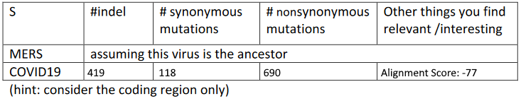
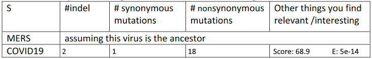

# Project 2: Gene Pairwise Alignment

# Requirements

1. You are required to read the following paper for your project:D Cyranoski, Profile of a killer: the complex biology powering the coronavirus pandemic. Nature. 2020 May; 581(7806):22-26. doi: 10.1038/d41586-020-01315-7. https://www.nature.com/articles/d41586-020-01315-7For    
graduate students,  read an additional paper for your project: Callaway E, Ledford H, Mallapaty S.,  Six Months of Coronavirus: The Mysteries Scientists Are Still Racing to Solve. Nature. 2020 Jul;583(7815):178-179. doi: 10.1038/d41586-020-01989-z. https://pubmed.ncbi.nlm.nih.gov/32620885/

2. Understand Genbank entries at NCBI and answer the following questions for https://www.ncbi.nlm.nih.gov/nuccore/NC_045512.2?report=genbank&to=29903i
    1. What’s the size/length of this virus genome? What is it made of? (RNA/DNA)?
    
        29903 Base Pairs of RNA

    2. How many genes does this virus genome contain; what are their names?

        11: ORF1ab, S, ORF3a, E, M, ORF6, ORF7a, ORF7b, ORF8, N, ORF10

    3. What does CDS mean? How many CDSs are there? How many proteins does thevirus genome code? What are they?

        CDS means Coding Sequence. There are 12 CDSs. @TODO

3. Implement pairwise alignment in python (or whatever language your group likes) (you group should figure out which alignment algorithm you need to use);

4. Pairwise align the sequence of a structural protein coding gene from COVID19 with the corresponding gene from SARS/MERS, for example [NC_045512.2](https://www.ncbi.nlm.nih.gov/nuccore/NC_045512.2):21563..25384 vs  [NC_019843.3](https://www.ncbi.nlm.nih.gov/nuccore/NC_019843):21456..25517;

5. Count the number of mutations and characterize each mutation. So you should have two tables like:

6. Run BLAST2seq on the two genes and summarize the finding:

7. Other things that might worth to look into.
